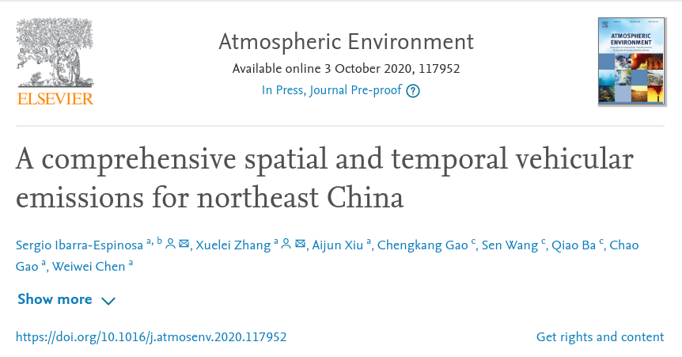
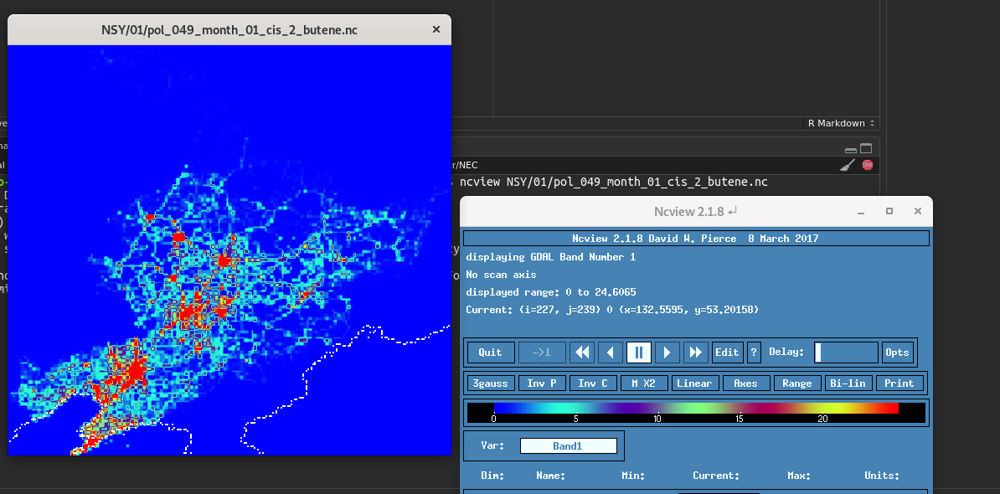

```{r, echo = FALSE}
knitr::opts_chunk$set(
  collapse = TRUE,
  comment = "#>",
  fig.path = "figures/"
)
```
## [A comprehensive spatial and temporal vehicular emissions for northeast China](https://www.sciencedirect.com/science/article/abs/pii/S1352231020306865)

[](https://www.sciencedirect.com/science/article/abs/pii/S1352231020306865)


Here you can download the emissions for each month.

Check the data with ncview:

```{bash, eval = F}
ncview NSY/01/pol_049_month_01_cis_2_butene.nc
```



You can also view the data using R

optionally, you can add coastlines from here

https://www.ngdc.noaa.gov/mgg/shorelines/data/gshhg/latest/

```{r, fig.width=8, fig.height=10}
library(stars)
library(cptcity)
#data
x <- read_stars("NSY/06/pol_071_month_06_hexane.nc")

# add coast lines
cl <- st_read("/media/sergio/ext4/coasts_shapefile/gshhg-shp-2.3.7/GSHHS_shp/f/GSHHS_f_L1.shp")
ne <- st_cast(st_crop(cl, x), "LINESTRING")

bk <- classInt::classIntervals(var = x$pol_071_month_06_hexane.nc, 
                               style = "fisher",
                               n = 100)
cols <- c(cpt(n = 70, rev = F), cpt("mpl_viridis", n = 30, rev = T))

plot(x, 
     col = cols,
     breaks = bk$brks, 
     key.pos = 1,
     axes = T,
     main = "",
     reset = F)
mtext(expression(Hexane~g~km^{-2}),  line = -5, col = "white", lwd = 2, cex = 2, at = c(52, 127))
plot(ne$geometry, add = T, col = "white", lwd = 2)

```

*citation*:

```
@article{IBARRAESPINOSA2020117952,
title = "A comprehensive spatial and temporal vehicular emissions for northeast China",
journal = "Atmospheric Environment",
pages = "117952",
year = "2020",
issn = "1352-2310",
doi = "https://doi.org/10.1016/j.atmosenv.2020.117952",
url = "http://www.sciencedirect.com/science/article/pii/S1352231020306865",
author = "Sergio Ibarra-Espinosa and Xuelei Zhang and Aijun Xiu and Chengkang Gao and Sen Wang and Qiao Ba and Chao Gao and Weiwei Chen"
}
```

