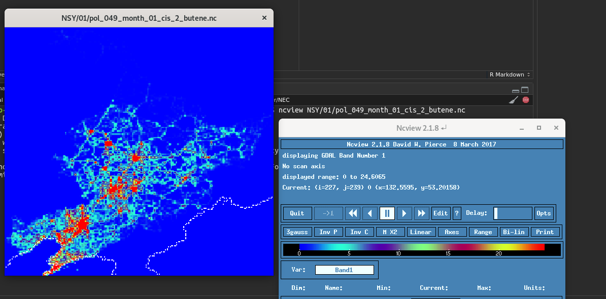
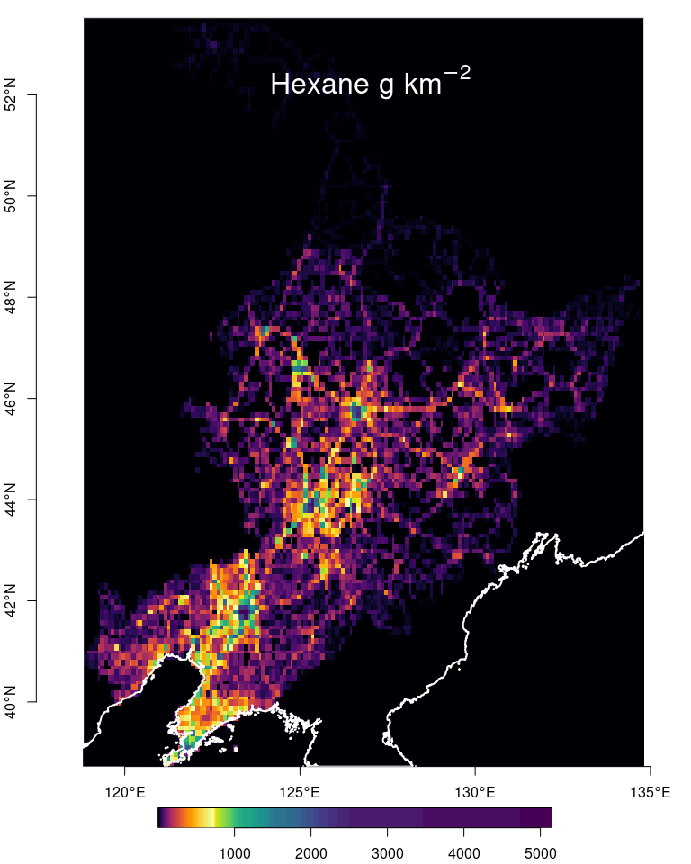

## [A comprehensive spatial and temporal vehicular emissions for northeast China](https://www.sciencedirect.com/science/article/abs/pii/S1352231020306865)

[](https://www.sciencedirect.com/science/article/abs/pii/S1352231020306865)

Here you can download the emissions for each month.

Check the data with ncview:

``` bash
ncview NSY/01/pol_049_month_01_cis_2_butene.nc
```



You can also view the data using R

optionally, you can add coastlines from here

<https://www.ngdc.noaa.gov/mgg/shorelines/data/gshhg/latest/>

``` r
library(stars)
#> Loading required package: abind
#> Loading required package: sf
#> Linking to GEOS 3.8.0, GDAL 3.0.4, PROJ 6.3.1
library(cptcity)
#data
x <- read_stars("NSY/06/pol_071_month_06_hexane.nc")

# add coast lines
cl <- st_read("/media/sergio/ext4/coasts_shapefile/gshhg-shp-2.3.7/GSHHS_shp/f/GSHHS_f_L1.shp")
#> Reading layer `GSHHS_f_L1' from data source `/media/sergio/ext4/coasts_shapefile/gshhg-shp-2.3.7/GSHHS_shp/f/GSHHS_f_L1.shp' using driver `ESRI Shapefile'
#> Simple feature collection with 179837 features and 6 fields
#> geometry type:  POLYGON
#> dimension:      XY
#> bbox:           xmin: -180 ymin: -68.92453 xmax: 180 ymax: 83.63339
#> geographic CRS: WGS 84
ne <- st_cast(st_crop(cl, x), "LINESTRING")
#> although coordinates are longitude/latitude, st_intersection assumes that they are planar
#> Warning: attribute variables are assumed to be spatially constant throughout all
#> geometries
#> Warning in st_cast.MULTIPOLYGON(X[[i]], ...): line from first ring only

bk <- classInt::classIntervals(var = x$pol_071_month_06_hexane.nc, 
                               style = "fisher",
                               n = 100)
#> Warning in classInt::classIntervals(var = x$pol_071_month_06_hexane.nc, : N is
#> large, and some styles will run very slowly; sampling imposed
cols <- c(cpt(n = 70, rev = F), cpt("mpl_viridis", n = 30, rev = T))

plot(x, 
     col = cols,
     breaks = bk$brks, 
     key.pos = 1,
     axes = T,
     main = "",
     reset = F)
mtext(expression(Hexane~g~km^{-2}),  line = -5, col = "white", lwd = 2, cex = 2, at = c(52, 127))
plot(ne$geometry, add = T, col = "white", lwd = 2)
```

<!-- -->

*citation*:

    @article{IBARRAESPINOSA2020117952,
    title = "A comprehensive spatial and temporal vehicular emissions for northeast China",
    journal = "Atmospheric Environment",
    pages = "117952",
    year = "2020",
    issn = "1352-2310",
    doi = "https://doi.org/10.1016/j.atmosenv.2020.117952",
    url = "http://www.sciencedirect.com/science/article/pii/S1352231020306865",
    author = "Sergio Ibarra-Espinosa and Xuelei Zhang and Aijun Xiu and Chengkang Gao and Sen Wang and Qiao Ba and Chao Gao and Weiwei Chen"
    }
